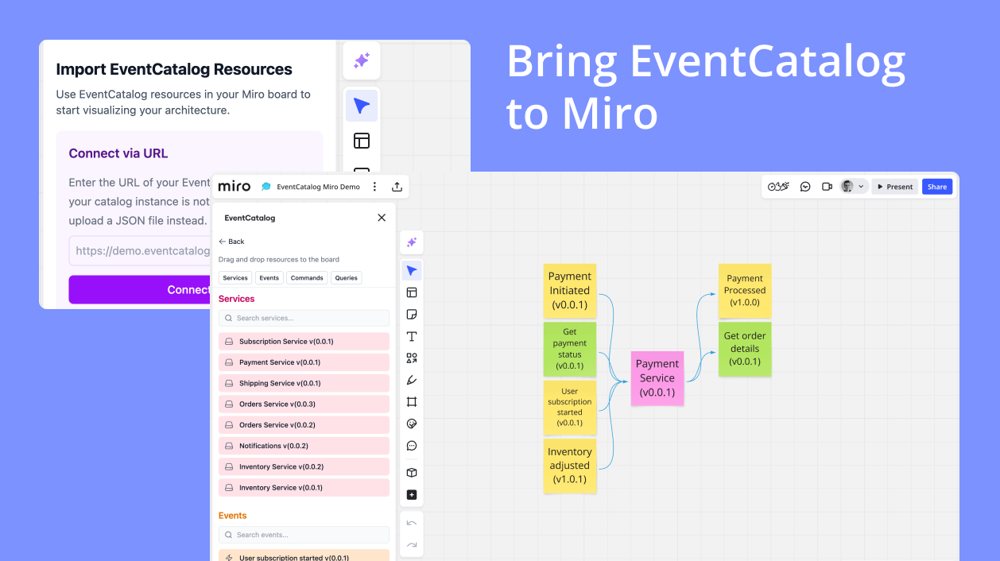

<div align="center">

<h1>📖 EventCatalog - Miro Integration</h1>
<h3>Bring your services, commands, queries and events to your Miro board</h3>
<p>Import your architecture resources directly into your Miro board, for collaboration with your team.</p>




<h4>Features: Import resources directly into your Miro board. Visualize your services, commands, queries and events. Service producers and consumers visualized. Generate from OpenAPI and AsyncAPI documents. Import via API or JSON file. Get running in minutes. </h4>
</div>

---

### What is the EventCatalog Miro App?

The EventCatalog Miro App lets you import your EventCatalog resources directly into your Miro board, for collaboration with your team.

You can import services, commands, queries and events from your EventCatalog instance into your Miro board, you can do this via a JSON file or by importing from a URL.

Import and drag resources into new architecture diagrams, event storming diagrams, or just use the resources to get started with your next project.

## Installation

_The EventCatalog Miro App is currently waiting for approval from Miro to be listed on the market place, so for now you can install it by clicking the link below._

- Open the installation page, which can be found [here](https://miro.com/app-install/?response_type=code&client_id=3458764623600229458&redirect_uri=%2Fapp-install%2Fconfirm%2F)
- Select the team you want to install the app to
- Install the application

## Usage

1. Load the app onto your board (previous steps)
2. Open the app (Click on Tools, Media and Integrations)
3. Search "EventCatalog" and select the app


### Importing resources from EventCatalog

You have two options:

1. [Import resources from a URL](#importing-resources-from-a-url)
2. [Import resources from a JSON file](#importing-resources-from-a-json-file)

#### Importing resources from a URL

- Open the miro application and enter the URL of the EventCatalog (must be public)
- Your resources will be imported into the board
- Drag and drop the resources to the board where you want them

#### Importing resources from a JSON file

- Navigate to your EventCatalog instance and download the JSON file
- Open the API route `api/catalog` (e.g `http://demo.eventcatalog.dev/api/catalog`)
- Save the JSON file to your local machine, and import it into the app
- Drag and drop the resources to the board where you want them

### Roadmap

- [x] Let users import resources from EventCatalog from a URL
- [x] Let users import resources from a JSON file
- [] Get published on Miro Marketplace
- [ ] Let users create resource types
- [ ] Export designs back into EventCatalog

### Contributing

**&nbsp;ℹ&nbsp;Note**:

- We recommend a Chromium-based web browser for local development with HTTP. \
  Safari enforces HTTPS; therefore, it doesn't allow localhost through HTTP.
- For more information, visit our [developer documentation](https://developers.miro.com).

### How to start locally

- Run `npm i` to install dependencies.
- Run `npm start` to start developing. \
  Your URL should be similar to this example:
 ```
 http://localhost:3000
 ```
- Paste the URL under **App URL** in your
  [app settings](https://developers.miro.com/docs/build-your-first-hello-world-app#step-3-configure-your-app-in-miro).
- Open a board; you should see your app in the app toolbar or in the **Apps**
  panel.

### How to build the app

- Run `npm run build`. \
  This generates a static output inside [`dist/`](./dist), which you can host on a static hosting
  service.

### Folder structure

<!-- The following tree structure is just an example -->

```
.
├── src
│  ├── assets
│  │  └── style.css
│  ├── app.tsx      // The code for the app lives here
│  └── index.ts    // The code for the app entry point lives here
├── app.html       // The app itself. It's loaded on the board inside the 'appContainer'
└── index.html     // The app entry point. This is what you specify in the 'App URL' box in the Miro app settings
```
