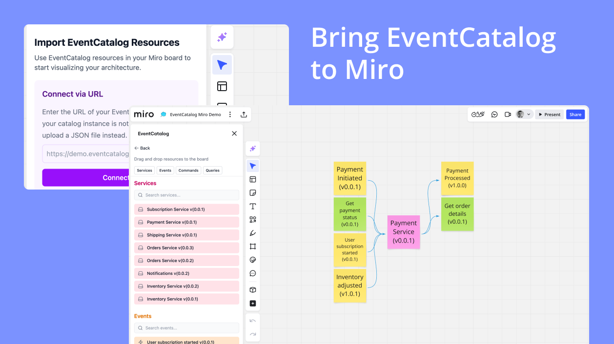
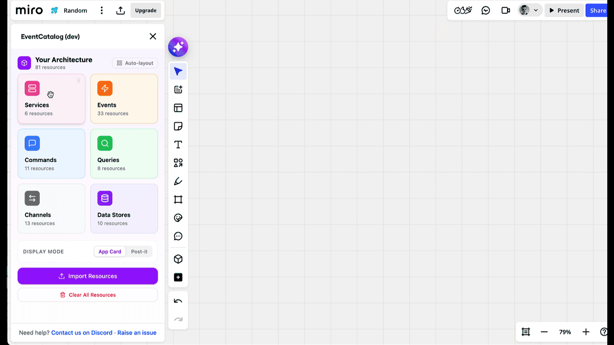
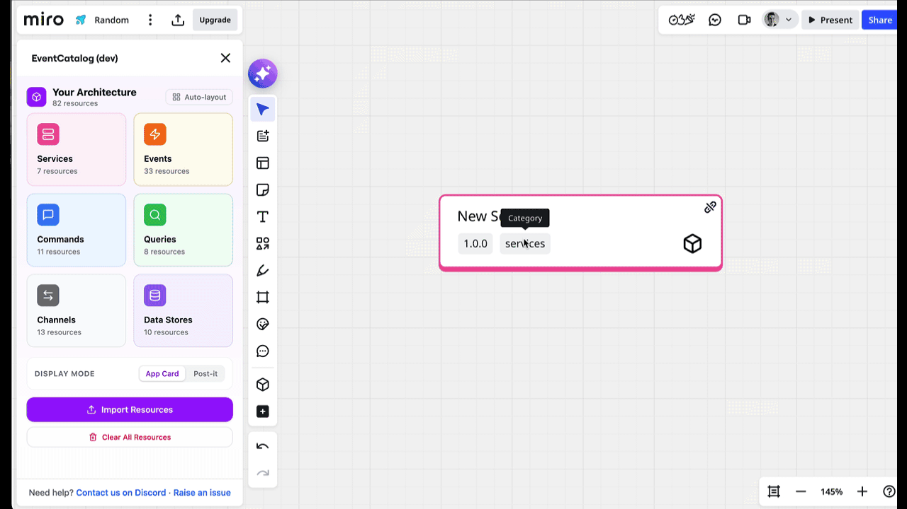
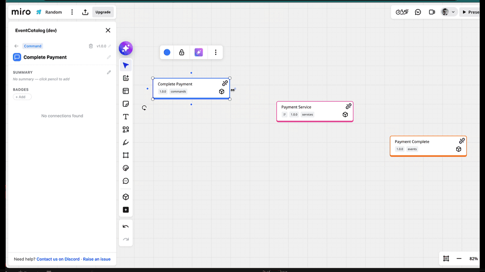
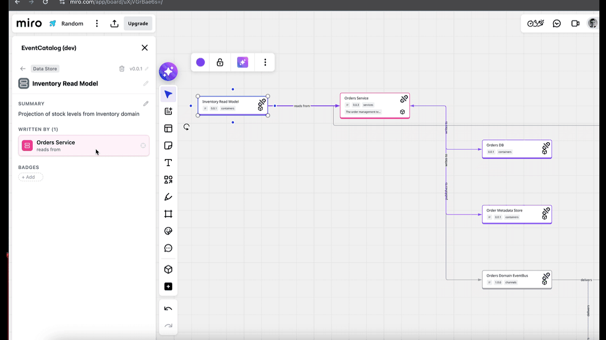
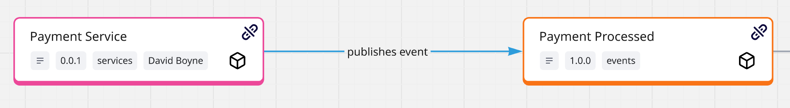
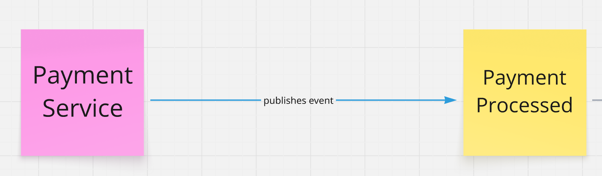

<div align="center">

<h1>EventCatalog - Miro App</h1>
<h3>Bring your architecture into Miro for collaborative visual design</h3>
<p>Import your EventCatalog resources into Miro, design your next iteration, and export changes back to your catalog.</p>



</div>

---

## What is the EventCatalog Miro App?

The EventCatalog Miro App lets you bring your architecture artifacts into Miro — drag services, events, commands, and more onto a board to collaboratively design and explore your systems.

Many teams already use Miro for event storming, system design, and planning. This app lets you work with your real architecture resources instead of generic boxes and lines.

### Key Features

- **Import your real architecture** — bring services, events, commands, queries, channels, and data stores from EventCatalog into Miro
- **Drag and drop** — drag resources from the sidebar onto the board
- **Automatic connections** — draw connectors between resources and the app automatically labels them (e.g. "publishes event", "receives", "writes to")
- **Two display modes** — view resources as detailed App Cards or compact Post-it notes
- **Create new resources** — sketch out new services and events directly in the app
- **Inline editing** — edit names, versions, summaries, and badges without leaving the board
- **Dependencies toggle** — choose whether to add a service with its full dependency graph or standalone
- **Auto-layout** — automatically arrange resources in a clean left-to-right flow
- **Connection highlighting** — select a resource to see all its connections highlighted
- **Export to JSON** — export the board for use with AI-powered catalog updates
- **Works with OpenAPI, AsyncAPI, and Schema Registries** — import from any supported specification via EventCatalog plugins

## Demo

### Dragging resources onto the board



### Services with dependencies


### Editing resources



### Automatic connectors



### Navigating connected resources



### Display modes

**App Card**



**Post-it**



## Installation

1. Open the [EventCatalog Miro App installation page](https://miro.com/app-install/?response_type=code&client_id=3458764623600229458&redirect_uri=%2Fapp-install%2Fconfirm%2F)
2. Select the team you want to install the app to
3. Install the application
4. Open a Miro board, go to **Tools, Media and Integrations**, and search for **EventCatalog**

## Usage

### Importing resources

1. In your EventCatalog project, run `npm run export` to generate a JSON file
2. Open the Miro app and click **Import Resources**
3. Upload the JSON file or paste the JSON directly

### Adding resources to the board

- Click a category (e.g. Services) to see all resources, then drag them onto the board
- Or drag a category card from the dashboard to create a new blank resource

### Editing resources

- Click any resource on the board to view and edit its details
- Edit name, version, and summary inline
- Add or remove badges
- Click connected resources to navigate between them

### Exporting

Click **Export to JSON** on the dashboard to download the current board state. Use this with [EventCatalog Skills](https://github.com/event-catalog/skills) to update your catalog using AI.

## Documentation

Full documentation is available at [eventcatalog.dev/docs/miro/overview](https://eventcatalog.dev/docs/miro/overview).

## Contributing

We welcome contributions! See the [contributing guide](https://eventcatalog.dev/docs/miro/getting-involved) for details.

**Note**:

- We recommend a Chromium-based web browser for local development with HTTP. \
  Safari enforces HTTPS; therefore, it doesn't allow localhost through HTTP.
- **Chrome 142+** blocks public sites (like miro.com) from loading localhost in an iframe by default. \
  To fix this, go to `chrome://settings/content/localNetworkAccess` and add `https://miro.com` to the **Allowed** list.
- For more information, visit the [Miro developer documentation](https://developers.miro.com).

### How to start locally

```bash
npm install
npm start
```

Your URL should be similar to `http://localhost:3000`. Paste it under **App URL** in your [app settings](https://developers.miro.com/docs/build-your-first-hello-world-app#step-3-configure-your-app-in-miro).

### How to build

```bash
npm run build
```

This generates a static output inside `dist/`, which you can host on a static hosting service.

## Community

- [Discord](https://eventcatalog.dev/discord) — chat with us and other users
- [GitHub Issues](https://github.com/event-catalog/eventcatalog-miro-app/issues) — report bugs or request features
- [eventcatalog.dev](https://eventcatalog.dev) — learn more about EventCatalog
